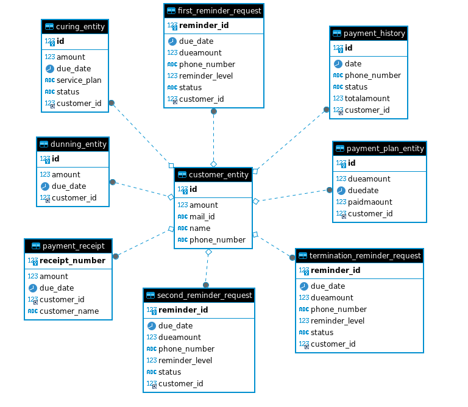

# Project Checklist

## 1. Backend
- [x] Code
- [x] Documentation(http://localhost:8080/swagger-ui/index.html#/)

## 2. Frontend
- [ ] Code
- [ ] Documentation

## 3. Database Model Visualization
- [x] 

## 4. Test Coverage
- [ ] Reports

## 5. Requirements
- [x] [SRS Documentation](https://github.com/Saisri-Gajula/Capstone-Project/tree/main#readme)
